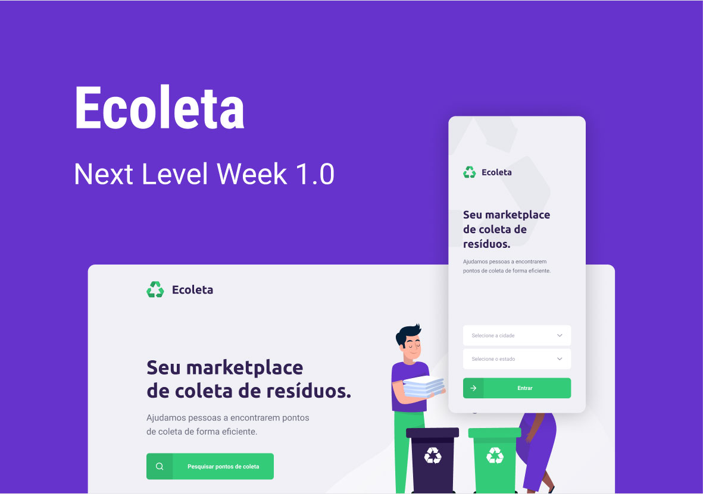

# Ecoleta



This repository holds code developed during the NLW#1(Next Level Week ) organized by Rocketseat. 

The challenge was to develop in only one week a application with back-end, front-end and mobile app.

[TOC]

## **Technologies**

NodeJs, Rect and React-Native


## **What I learned?**

A lot of new things, I had no prior knowledge of react, needer react-native. 

### Backend

Fist of all we develop a backend that expose an API to our web and mobile application consume.  That was developed with NodeJS + Express + Knex, and we tested using **Postman**.

I already made some projects using NodeJS+Express+Sequelize, but I am impressed with how powerful **Knex** could be, is a query builder and not a ORM, we have control of how make each queries to the database with flexibility to change from sqlite, postgres, or even oracle with just a simple setup.

Input validation using using **Celebrate**, a library based on **Joi** to use schema validation.

We use **Multer** to make image upload too, almost plug and play with simple setup to validate file types, and where to store then.


### Web Application

We use **Axios**, to connect to a public api to display cities and states in select input forms,  and to consume data of our back-end.

**Leaflet** to display a beautiful map were the user can click to point where exactly is the establishment is located.

And before I forget to mention, our web application is SPA(Single Page Application) using **React** to make screen transitions and compose the screen with these components.


### Mobile

With **React-Native** we can develop to Android and iOS at same time.

That was the most energizing experience I had leaning something, in less than 10 minutes we had a basic setup and I could see the app in my phone and watch they grow in... 6 hours to complete application, the use geolocalization to display places near the user in a map, consume data from back-end, filter for witch kind of material each collect point accept, and used deep linking to open whatsapp in a conversation with the establishment contact or the email app.


## How to setup?

Clone this repository

```shell
git clone https://github.com/RafaelFigueiredo/NLW-Rocketseat.git
```


### Backend

Install dependencies

```shell
cd server
yarn install
```
Run database migrates and seed with initial items
```shell
yarn knex:migrate
yarn knex:seed
```
Run server in development mode (hot reloding)
```shell
yarn dev
```

### Frontend
Install dependencies
```shell
cd web
yarn install
```
Run react client
```shell
yarn start
```

### Mobile

Install dependencies
```shell
cd mobile
yarn install
```
Run react-native client
```shell
yarn start
```